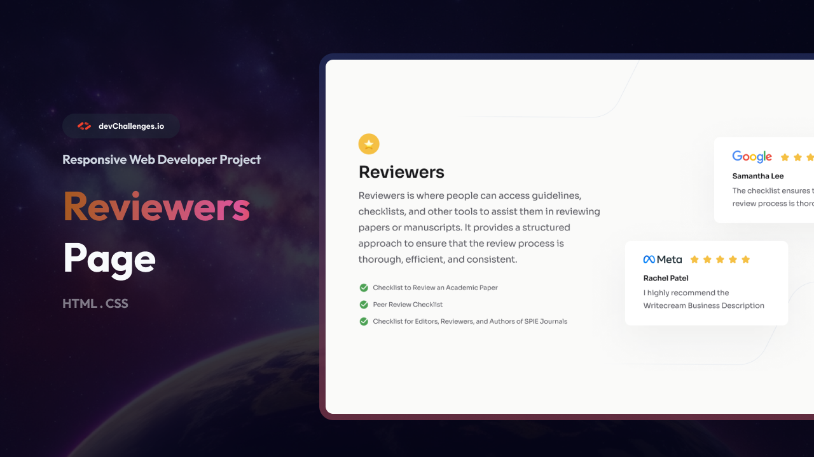

# Testimonial Page | devChallenges

Solution for a challenge <a href="https://devchallenges.io/challenge/testimonial-page" target="_blank">Testimonial Page</a> from <a href="https://devchallenges.io" target="_blank">devChallenges.io</a>.

  <h3>
    <a href="YOUR_DEMO_LINK">
      Demo
    </a>
     | 
    <a href="YOUR_SOLUTION_LINK">
      Solution
    </a>
     | 
    <a href="https://devchallenges.io/challenge/testimonial-page">
      Challenge
    </a>
  </h3>

## Overview

### Screenshot

### What I learned

* Improved my responsive web design skills.
* Practiced using Flexbox to create the main layout.
* Learned how to position testimonial cards differently on desktop, tablet, and mobile.
* Practiced creating responsive layouts using CSS media queries.
* Improved my understanding of spacing, alignment, typography, and shadows in CSS.

### Useful resources

* [MDN Web Docs - CSS Flexbox](https://developer.mozilla.org/en-US/docs/Web/CSS/CSS_flexible_box_layout) - Helped me understand and use Flexbox for the page layout.
* [MDN Web Docs - CSS Media Queries](https://developer.mozilla.org/en-US/docs/Web/CSS/CSS_media_queries) - Helped me create responsive layouts for different screen sizes.

## Built with

* Semantic HTML5 markup
* CSS custom properties
* Flexbox
* CSS Media Queries
* Responsive Design

## Features

* Responsive design for desktop, tablet, and mobile.
* Testimonial cards with Google and Meta reviews.
* Responsive positioning of testimonial cards.
* Checklist section with icons.
* Clean and simple UI based on the devChallenges design.

## Acknowledgements

* [devChallenges.io](https://devchallenges.io/) for providing the challenge and design.

## Author

* GitHub [@yoz0816](https://github.com/yoz0816)
