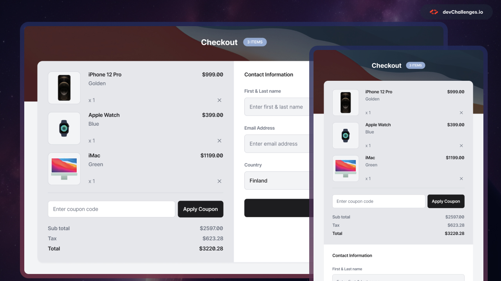

# Device Shop Checkout | devChallenges

  Solution for the <a href="https://devchallenges.io/challenge/apple-shop-checkout-page-challenge" target="_blank">Device Shop Checkout</a> challenge from <a href="https://devchallenges.io" target="_blank">devChallenges.io</a>.

  <h3>
    <a href="https://yoz0816.github.io/DevChallenges/device-shop-checkout-master/">
      Demo
    </a>
     | 
    <a href="https://github.com/yoz0816/DevChallenges/tree/main/device-shop-checkout-master">
      Solution
    </a>
     | 
    <a href="https://devchallenges.io/challenge/apple-shop-checkout-page-challenge">
      Challenge
    </a>
  </h3>

---

## Table of Contents

- [Device Shop Checkout | devChallenges](#device-shop-checkout--devchallenges)
  - [Table of Contents](#table-of-contents)
  - [Overview](#overview)
    - [Screenshot](#screenshot)
    - [What I learned](#what-i-learned)
    - [Useful resources](#useful-resources)
  - [Built with](#built-with)
  - [Features](#features)
  - [Acknowledgements](#acknowledgements)
  - [Author](#author)
  - [Project Links](#project-links)

## Overview

This project is my solution to the **Device Shop Checkout** challenge from devChallenges.

The challenge was to recreate a checkout page from the provided design and make the layout responsive across desktop, tablet, and mobile screen sizes.

### Screenshot

### What I learned

While building this project, I practiced and improved my understanding of:

* Semantic HTML5
* CSS Flexbox
* CSS Grid
* Responsive web design
* Media queries
* Desktop, tablet, and mobile layouts
* Responsive product cards
* Responsive forms
* Form inputs and select elements
* Creating a responsive coupon section
* Aligning Country and Postal Code fields in the same row
* Working with images and SVG icons
* Using flexible widths instead of fixed widths
* Using `min()`, `flex`, and `grid`
* Matching spacing, sizing, borders, and typography from a design

One of the main things I learned from this challenge was how to create a layout that adapts to different screen sizes instead of depending on fixed widths and large spacing values.

### Useful resources

* [MDN Web Docs](https://developer.mozilla.org/) - Used as a reference for HTML and CSS.
* [CSS-Tricks](https://css-tricks.com/) - Helpful references for Flexbox and CSS Grid.
* [devChallenges](https://devchallenges.io/) - Challenge and design reference.

## Built with

* Semantic HTML5 markup
* CSS3
* Flexbox
* CSS Grid
* CSS Media Queries
* Responsive Design

## Features

* Responsive checkout page
* Product list with product images
* Product names and colors
* Product prices
* Product quantities
* Remove-product icons
* Coupon code input
* Apply Coupon button
* Subtotal calculation display
* Tax display
* Total price display
* Contact information form
* Country selection
* Postal code input
* Country and Postal Code fields displayed in the same row
* Responsive desktop layout
* Responsive tablet layout
* Responsive mobile layout
* Responsive background image

## Acknowledgements

Thanks to [devChallenges](https://devchallenges.io/) for providing the challenge and design.

## Author

* GitHub: [@yoz0816](https://github.com/yoz0816)
* Frontend Mentor: [@yoz0816](https://www.frontendmentor.io/profile/yoz0816)

## Project Links

* **Live Demo:** https://yoz0816.github.io/DevChallenges/device-shop-checkout-master/
* **GitHub Repository:** https://github.com/yoz0816/DevChallenges/tree/main/device-shop-checkout-master