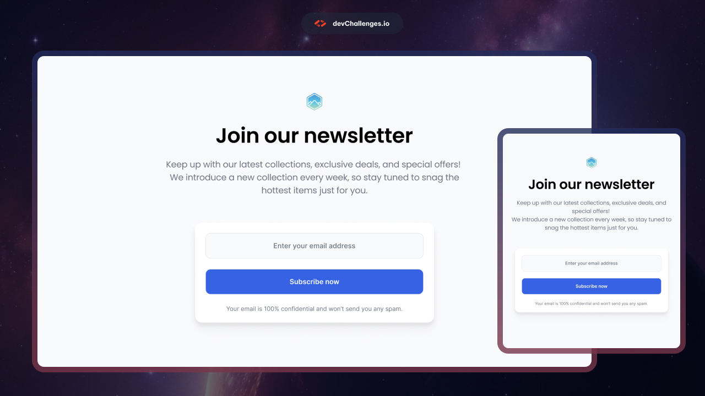

# DevChallenges - Join Our Newsletter

This is a solution to the **Join Our Newsletter** challenge from [DevChallenges](https://devchallenges.io/).

The goal of this challenge was to recreate a newsletter subscription section from the provided design while making the page responsive across **desktop, tablet, and mobile** screen sizes.

## Table of Contents

- [DevChallenges - Join Our Newsletter](#devchallenges---join-our-newsletter)
  - [Table of Contents](#table-of-contents)
  - [Overview](#overview)
    - [The Challenge](#the-challenge)
    - [Screenshot](#screenshot)
    - [Links](#links)
  - [My Process](#my-process)
    - [Built With](#built-with)
    - [What I Learned](#what-i-learned)
    - [Continued Development](#continued-development)
  - [Author](#author)

## Overview

### The Challenge

Users should be able to:

* View the newsletter subscription layout on different screen sizes.
* See a responsive design that works on desktop, tablet, and mobile devices.
* Enter their email address in the newsletter form.
* Interact with the subscription button.
* See hover and focus states on interactive elements.

### Screenshot

### Links

* **Solution:** [GitHub Repository](#)
* **Live Site:** [View Live Site](#)

## My Process

### Built With

* HTML5
* CSS3
* Flexbox
* Responsive Design
* CSS Media Queries
* Semantic HTML

### What I Learned

This challenge helped me practice creating a responsive layout from a provided design.

Some of the main things I practiced were:

* Using Flexbox to center and organize elements.
* Creating a responsive newsletter form.
* Using `max-width` to control text width.
* Creating responsive layouts with media queries.
* Adjusting typography for different screen sizes.
* Creating input focus states.
* Creating button hover states.
* 
### Continued Development

For future projects, I want to continue improving my:

* Responsive CSS skills
* Flexbox and CSS Grid
* Mobile-first development
* CSS typography and spacing
* Accessibility
* JavaScript form validation
* Interactive frontend components

## Author

Coded by **Yoz**

* GitHub: [@yoz0816](https://github.com/yoz0816)
* DevChallenges: [@yoz0816](https://devchallenges.io/)
