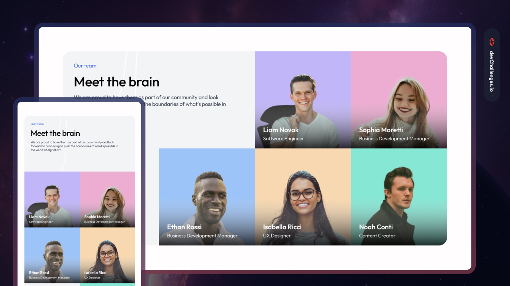

# DevChallenges - Team Layout

This is my solution to the **Team Layout** challenge from [DevChallenges](https://devchallenges.io/).

The goal of this challenge was to build a responsive team section that matches the provided design on both desktop and mobile screens.

## Table of Contents

- [DevChallenges - Team Layout](#devchallenges---team-layout)
  - [Table of Contents](#table-of-contents)
  - [Overview](#overview)
    - [What I learned](#what-i-learned)
    - [Useful resources](#useful-resources)
  - [Built with](#built-with)
  - [Features](#features)
  - [Screenshot](#screenshot)
  - [Links](#links)
  - [Acknowledgements](#acknowledgements)
  - [Author](#author)

## Overview

### What I learned

While working on this challenge, I practiced:

- Creating layouts with CSS Grid
- Positioning elements within a multi-column grid
- Building responsive layouts for desktop and mobile screens
- Using CSS gradients for image overlays
- Using pseudo-elements for decorative shapes
- Creating responsive typography
- Organizing HTML and CSS in a clean and maintainable way

### Useful resources

- [MDN - CSS Grid](https://developer.mozilla.org/en-US/docs/Web/CSS/CSS_grid_layout) - Helpful reference for creating and positioning elements with CSS Grid.
- [MDN - CSS Media Queries](https://developer.mozilla.org/en-US/docs/Web/CSS/CSS_media_queries) - Useful for creating responsive layouts.
- [DevChallenges](https://devchallenges.io/) - Platform used for the challenge.

## Built with

- Semantic HTML5 markup
- CSS custom properties
- CSS Grid
- Flexbox
- Responsive design
- CSS gradients
- Media queries

## Features

- Responsive team layout
- Desktop and mobile layouts
- Team member profile cards
- Image overlays with gradients
- CSS Grid-based layout
- Responsive typography
- Decorative background elements
- Accessible image `alt` text

## Screenshot

## Links

- Live Site: [View Live Site](https://yoz0816.github.io/DevChallenges/our-team-layout-master/)
- Repository: [GitHub Repository]()
- Challenge: [DevChallenges](https://devchallenges.io/)

## Acknowledgements

Thanks to [DevChallenges](https://devchallenges.io/) for providing the challenge and design inspiration.

## Author

- GitHub: [@yoz0816](https://github.com/yoz0816)
