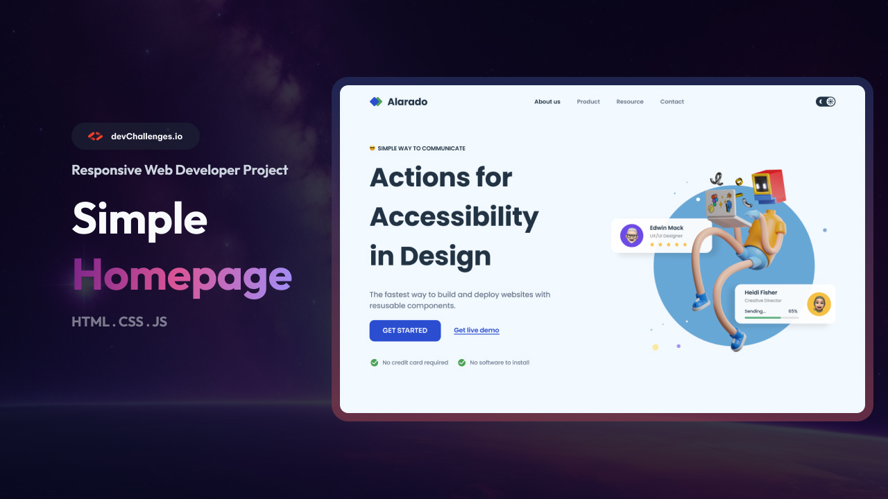

# Simple Homepage - Alarado | devChallenges

Solution for a challenge <a href="https://devchallenges.io/challenge/simple-hompage-alarado" target="_blank">Simple Homepage - Alarado</a> from <a href="https://devchallenges.io" target="_blank">devChallenges.io</a>.

  <h3>
    <a href="https://yoz0816.github.io/DevChallenges/simple-homepage-master/">
      Demo
    </a>
     | 
    <a href="https://github.com/yoz0816/DevChallenges/tree/main/simple-homepage-master">
      Solution
    </a>
     | 
    <a href="https://devchallenges.io/challenge/simple-hompage-alarado">
      Challenge
    </a>
  </h3>

## Table of Contents

- [Simple Homepage - Alarado | devChallenges](#simple-homepage---alarado--devchallenges)
  - [Table of Contents](#table-of-contents)
  - [Overview](#overview)
    - [What I learned](#what-i-learned)
    - [Useful resources](#useful-resources)
  - [Built with](#built-with)
  - [Features](#features)
  - [Acknowledgements](#acknowledgements)
  - [Author](#author)

## Overview

### What I learned

While working on this project, I practiced building a responsive homepage from a design and improved my understanding of:

* Semantic HTML5 structure
* CSS Flexbox for page layout
* Responsive design with media queries
* Creating a responsive navigation menu
* Positioning and spacing elements with CSS
* Working with custom fonts and icons
* Making the layout adapt to desktop, tablet, and mobile screens

### Useful resources

* [MDN Web Docs](https://developer.mozilla.org/) - Helpful reference for HTML and CSS.
* [W3Schools](https://www.w3schools.com/) - Useful for reviewing CSS properties and responsive design.
* [devChallenges](https://devchallenges.io/) - Provided the challenge design and requirements.

## Built with

* Semantic HTML5 markup
* CSS3
* Flexbox
* CSS Media Queries
* Responsive Web Design

## Features

* Responsive homepage layout
* Desktop, tablet, and mobile layouts
* Responsive navigation menu
* Hero section with call-to-action
* Custom typography
* Responsive images
* Accessible semantic HTML structure

## Acknowledgements

Thanks to [devChallenges](https://devchallenges.io/) for providing the design challenge and helping me practice my frontend development skills.

## Author

* GitHub: [@yoz0816](https://github.com/yoz0816)
* Frontend Mentor: [@yoz0816](https://www.frontendmentor.io/profile/yoz0816)
